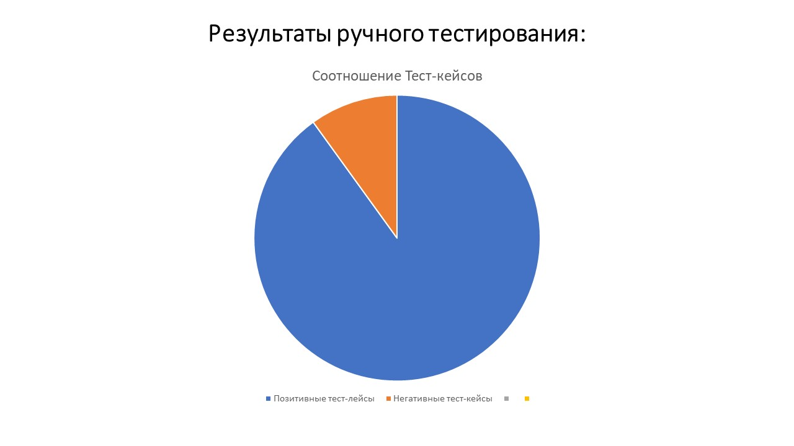

### Отчет о проведении ручного тестирования

В ходе ручного тестирования было проведено 673 теста, описанных в файле [Тест-кейсы](https://docs.google.com/spreadsheets/d/1r4ZZs8SwhNFJTdhG0v3x4JviyeYnAbFY/edit?gid=1191533890#gid=1191533890)
Выявлено 67 ошибок

В ходе ручного тестирования были выявлены следующие ошибки:

### Отчет о проведении автоматизированного тестирования

В ходе проведения ручного тестирования было принято решение о автоматизации некоторых тест кейсов, как позитивных, так и негативных.
Автоматизации приемущественно подверглись тест-кейсы, содержащие проверку основного функционала приложения, навигацию по приложению, проверку видимости некоторых важных элементов.
Было реализовано 66 тест-кейсов
8 из которых, выявляют ошибку
Так же присутствует ложное падение некотых тестов только при пакетном прогоне.
